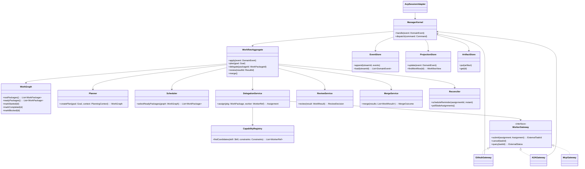
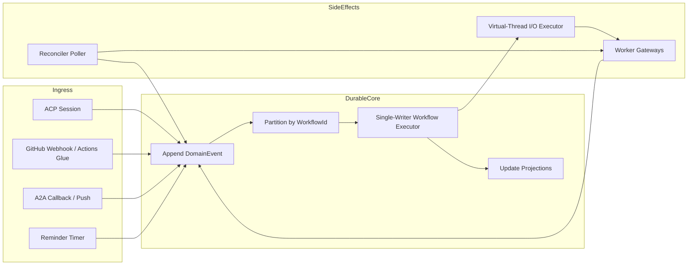

# Architektur eines universellen Manager-Agenten in Java 21

## Executive Summary

Ja: Mit einer **Java-21-Sidecar-Architektur** lässt sich ein moderner, hybrider Manager-Agent auf dem JVM-Stack realistisch umsetzen, auch wenn das Hauptprodukt auf Java 8 bleibt. Der entscheidende Punkt ist aber **nicht**, alles in einen einzigen „superautonomen“ Agenten zu gießen. Nach dem Stand der aktuellen Praxis und Literatur funktionieren robuste Systeme besser als **deterministischer Manager-Kern** mit klarer Zustandsmaschine, persistentem Arbeitsgraphen, Review-/Governance-Schicht und klar getrennten Protokolladaptern; LLMs übernehmen darin gezielt Planung, Delegation, Bewertung und Synthese, aber nicht die gesamte Betriebslogik. Anthropic unterscheidet deshalb ausdrücklich zwischen **Workflows** mit vordefinierten Pfaden und **Agents** mit dynamischer Werkzeugnutzung; für Unternehmenskontexte sind einfache, komposable Workflows oft vorhersagbarer. Zugleich zeigen aktuelle Skalierungsarbeiten, dass Multi-Agent-Setups nur dann stark helfen, wenn Aufgaben wirklich parallel oder sauber zerlegbar sind; für stark sequentielle Planung können sie sogar schlechter sein als ein Single-Agent-Ansatz. citeturn12view8turn12view9turn30view3turn5search11

Für dein konkretes Szenario ist die architektonische Trennung der Protokolle zentral: **ACP** ist die richtige Schicht für **IDE-Integration** und interaktive Sitzungen mit JetBrains; **MCP** ist die richtige Schicht für **Tool- und Ressourcenzugriff**; **A2A** oder ein internes, domänenspezifisches Event-/Task-Protokoll ist die richtige Schicht für **Subagent-Delegation, Langläufer und asynchrone Rückmeldungen**. JetBrains unterstützt genau das von dir beschriebene Muster bereits offiziell: In der IDE können konfigurierte MCP-Server und der integrierte IntelliJ-MCP-Server an ACP-Agenten „durchgereicht“ werden; protokollseitig werden diese Server in `session/new` an den Agenten übergeben. Das macht dein Modell „IDE als ACP-Frontend, eigener MCP-Aggregator als Tool-Gateway, Manager-Kern als eigentliche Orchestrierung“ fachlich sehr plausibel. citeturn12view0turn12view3turn12view1turn14view0

Wenn du Kotlin im Sidecar akzeptierst, ist **Koog** derzeit der integrierendste JVM-Kandidat, weil es auf dem JVM-Stack **Java- und Kotlin-APIs**, **MCP**, **A2A**, **ACP**, **Graph-Workflows**, **Planner Agents**, **Durable Execution**, **History Compression** und **OpenTelemetry** zusammenführt. Wenn du strikt bei Java bleiben und maximale architektonische Kontrolle behalten willst, ist die stärkste Kombination aus heutiger Sicht ein **eigener Manager-Kern in Java 21** plus **ACP Java SDK** für IDE-Anbindung, **A2A Java SDK** für Subagent-Kommunikation und wahlweise **LangChain4j** oder **Spring AI** als Modell-/Tool-Abstraktion. Für hochgradig message-getriebene, fehlertolerante Ausführung kann zudem **Apache Pekko** als Actor-/Persistence-Layer sinnvoll sein, ist aber komplexer als ein eigener Single-Writer-Kern. citeturn27view0turn19view0turn13view0turn12view11turn14view1turn18search2turn18search4

Die wichtigste fachliche Empfehlung lautet daher: **Baue keinen autonomen „Alleskönner“, sondern einen universellen Manager-Kern mit Rollen**. Dieser Kern plant, zerlegt, terminisiert, delegiert, reagiert auf Events, pollt zur Wiedervorlage, reviewed Ergebnisse und merged Artefakte. Die ausführenden „Worker“ dürfen externe Coding-Agents wie GitHub Copilot cloud agent, A2A-Agents, MCP-Tools oder spätere private Coding-Agents sein. Moderne Arbeiten zu Agentenarchitekturen sprechen genau für diese Kombination aus **Reasoning, Reflection, Collaboration, Governance, Memory und expliziter Ausführungstopologie**. citeturn34view0turn30view4turn30view0turn13view7

## Protokoll- und Integrationsrahmen

Die JetBrains-Seite ist für dein Vorhaben erstaunlich direkt anschlussfähig. In den AI-Assistant-Einstellungen können installierten ACP-Agenten sowohl **konfigurierte MCP-Server** als auch der **integrierte IntelliJ-MCP-Server** exponiert werden. In der ACP-Spezifikation ist dafür vorgesehen, dass der Client beim Erzeugen einer Sitzung per `session/new` den **Arbeitsordner** und eine **Liste von MCP-Servern** übergibt. Außerdem bieten JetBrains-IDEs seit 2025.2 einen integrierten MCP-Server an, der externen Clients Zugriff auf IDE-Funktionen gibt. Praktisch heißt das: Dein Sidecar kann als ACP-Agent laufen, und die IDE kann deinen eigenen MCP-Aggregator sowie den IntelliJ-MCP-Server beim Start in die Sitzung „injizieren“. Das ist kein Hack, sondern ein protokollkonformes Nutzungsmuster. citeturn12view0turn12view3turn12view1turn12view2

Wichtig ist die saubere Abgrenzung der Zuständigkeiten. **ACP** standardisiert die Kommunikation zwischen Editor/IDE und Agent. **MCP** standardisiert die Verbindung zwischen Agent und Tools/Ressourcen. **A2A** standardisiert die Kommunikation zwischen Agenten, inklusive Discovery über Agent Cards, Task-Lifecycle, Streaming und asynchronen Benachrichtigungen. Die offizielle A2A-Dokumentation beschreibt A2A und MCP ausdrücklich als **komplementär**: MCP ist „agent-to-tool“, A2A ist „agent-to-agent“. Für deinen universellen Manager heißt das: ACP an der IDE-Kante, MCP für Tool-Zugänge, A2A oder interne Event-Contracts für Subagent-Kollaboration. citeturn29view0turn14view0turn12view6turn13view0

Für Subagenten wie **GitHub Copilot cloud agent** ist das Bild etwas asymmetrischer. Copilot cloud agent kann Repositories recherchieren, Implementierungspläne erzeugen, Bugs beheben, Tests verbessern, Branches anlegen und Pull Requests erstellen; er arbeitet dabei in einer **ephemeren, GitHub-Actions-basierten Entwicklungsumgebung**. Aufgaben lassen sich aus Issues, IDEs, über die GitHub-Oberfläche, den GitHub MCP Server und weitere Einstiegspunkte starten; es gibt außerdem **custom agents**, **MCP servers**, **hooks** und **skills**. Das passt gut zu deiner Vorstellung eines universellen Managers, der externe ausführende Spezialisten steuert. Aber Copilot bleibt für dich ein **externer, teilweise opaker Worker**, kein Ersatz für deinen Kern. citeturn15view1turn15view0

Für die Reaktivität auf GitHub-Ereignisse solltest du dich nicht auf eine einzelne Mechanik verlassen. GitHub stellt Webhooks für Issues, Kommentare, Pull Requests, Pull-Request-Reviews, Workflow-Runs und weitere Ereignisse bereit; Actions-Workflows lassen sich unter anderem über `pull_request`-Aktivitäten oder `closed` plus `merged`-Bedingung steuern. Gleichzeitig dokumentiert GitHub für Copilot cloud agent eine relevante Einschränkung: Wenn du ein Issue an Copilot delegierst, erhält Copilot beim Start Titel, Beschreibung, bestehende Kommentare und zusätzliche Anweisungen, **reagiert aber nicht auf später hinzugefügte Issue-Kommentare**; Änderungen sollen stattdessen über den entstehenden Pull Request eingespielt werden. Daraus folgt für deinen Manager ein klares Muster: **Commands** an externe Coding-Worker, **Events** aus GitHub als Beobachtungskanal und **Polling/Reconciliation** als Fallback, falls Events ausbleiben oder Integrationen semantisch unvollständig sind. citeturn32view2turn33view0turn32view0turn15view0

## Wissenschaftliche Architekturprinzipien für den Manager-Kern

Die aktuelle Literatur spricht dafür, deinen Kern **hybrid** zu bauen: nicht rein reaktiv, nicht rein deliberativ, sondern als Kombination aus **explizitem Workflow**, **planbasierter Delegation**, **Review-Schleifen** und **persistenter Erinnerung**. Das passt sowohl zu Anthropic’s Orchestrator-Worker- und Evaluator-Optimizer-Mustern als auch zu neueren methodischen Übersichten, die Agenten über Topologie und kognitive Funktionen einordnen. Besonders hilfreich ist hier die Zweidimensionalität: Neben der Frage, **wie** Daten und Arbeit fließen, muss man modellieren, **was** der Agent kognitiv tut – Kontextmanagement, Memory, Reasoning, Action, Reflection, Collaboration und Governance. Genau diese Kategorien erklären, warum dein „Manager“ nicht nur planen und delegieren, sondern auch priorisieren, verifizieren, eskalieren, budgetieren und re-synchronisieren können muss. citeturn12view9turn12view8turn34view0turn30view4

Aus deiner Beschreibung fehlen – im Sinne moderner Agentenforschung – vor allem fünf Fähigkeiten, die ich als **Pflichtbestandteile** ansehen würde. Erstens **persistente Memory-/Checkpointing-Schichten**, damit Langläufer nach Neustarts oder Session-Wechseln nicht von vorn beginnen. Zweitens **Governance/Policy Gates**, also Regeln, welche Aktionen autonom sind und welche Review oder Freigabe brauchen. Drittens **Capability Discovery und Delegationsverträge**, damit der Kern nicht „blind“ an Subagenten delegiert. Viertens **systematische Reflection/Review-Schleifen**, um Ergebnisse zu kritisieren und zu verbessern. Fünftens **Observability**, weil sich Agentensysteme ohne Traces und Ereignisprotokolle kaum stabil betreiben lassen. Die neueren Surveys zu Agent Evaluation, Memory und Design Patterns stützen genau diese Sicht. citeturn30view0turn30view2turn34view0turn27view0

Für die eigentliche Arbeitslogik ist ein **expliziter WorkGraph** der richtige Kern. Plane nicht bloß eine Liste von Tasks, sondern eine gerichtete Struktur aus Arbeitspaketen mit Abhängigkeiten, Parallelisierbarkeit, Deadlines, Budgets, Review-Anforderungen und Merge-Strategie. Moderne Planungsübersichten ordnen LLM-Planung unter Task Decomposition, Plan Selection, Reflection und Memory ein; Anthropic beschreibt denselben Gedanken operativ als Orchestrator-Workers. Deine User Stories – Coding-Management, Research-Management, PR-Steuerung, Synthese wissenschaftlicher Abschnitte – sind praktisch Spezialfälle desselben Modells: **Plan → Pakete → Delegation → Beobachtung → Review → Merge/Synthese**. citeturn30view1turn12view9turn12view10

Der vielleicht wichtigste wissenschaftliche Befund für deinen Entwurf ist: **Mehr Subagenten sind nicht automatisch besser**. Die Google-Arbeit zu Skalierung von Agentensystemen zeigt, dass koordinierte Multi-Agent-Architekturen auf parallelisierbaren Aufgaben stark gewinnen können, bei sequentieller Planung oder tool-heavy Overhead aber verlieren; außerdem propagieren Architekturen ohne zentrale Verifikation Fehler leichter als Systeme mit zentraler Koordination. Für deinen Manager ist das ein starkes Argument, Entscheidungen über Parallelisierung **nicht dem Worker-Schwarm zu überlassen**, sondern im Manager-Kern anhand des WorkGraphen und klarer Heuristiken zu treffen. Coding-Einheiten mit klaren Dateigrenzen oder Forschungsstränge mit geringer semantischer Kopplung kannst du parallelisieren; eng gekoppeltes Refactoring, finale Synthese und Merge-Entscheidungen sollten zentral bleiben. citeturn30view3turn5search11

Ebenso wichtig ist die Erkenntnis aus Langläufer-Harnesses: Agenten arbeiten in der Praxis oft in **diskreten Sitzungen** mit begrenztem Kontextfenster. Deshalb braucht dein Manager **Handoff-Memos**, Verlaufskompression, Checkpoints und eine klare Trennung zwischen **episodischem Speicher** (wer tat wann was), **semantischem Projektspeicher** (Policies, Architektur, Standards, bekannte Risiken) und **Artefaktspeicher** (PRs, Reviews, Berichte, Teilergebnisse). Ohne diese Schichten wird dein Agent bei jedem Wiederanlauf denselben Kontext neu rekonstruieren und dieselben Fehler wiederholen. citeturn13view7turn30view2turn27view0

## Framework- und Bibliotheksvergleich

Für deinen Java-21-Sidecar gibt es keinen einzelnen „perfekten“ JVM-Stack, aber es gibt eine sehr klare Aufteilung nach Rollen. Die folgende Tabelle vergleicht die relevantesten Kandidaten für deinen Manager-Kern und seine Adapter. Die Spalte „Link“ verweist jeweils auf die offizielle Quelle oder das offizielle Repository. citeturn19view0turn13view0turn27view0turn14view1turn18search0

| Name | Lizenz | JVM-/Java-21-Eignung | Hauptfunktionen | Einschränkungen | Link |
|---|---|---|---|---|---|
| ACP Java SDK | Open Source; exakter Lizenztyp in den genutzten Ausschnitten nicht bestätigt | **Java 17+**, damit problemlos für Java-21-Sidecar geeignet | Pure-Java-ACP-Implementierung; Sync/Async/Annotation-API; Stdio und WebSocket; Capability Negotiation; Test-Hilfen (`acp-test`) | Fokussiert auf **IDE/Client-Agent-Protokoll**, nicht auf langlaufende Orchestrierung oder Agent-zu-Agent-Delegation | Offiziell citeturn19view0turn12view4 |
| ACP Kotlin SDK | Open Source; Dependency in Doku als Snapshot gezeigt | JVM-geeignet; JetBrains nutzt es selbst für ACP-Integrationen | Beide Seiten des ACP; JVM-Support; gute Basis für Kotlin-basierte Sidecars | Kotlin-first; in der Doku ist die gezeigte Dependency noch Snapshot-basiert | Offiziell citeturn12view5turn13view1 |
| A2A Java SDK | **Apache-2.0** | Für Java-Server und -Clients gebaut; damit passend für Java 21 | Agent Cards, Client/Server, JSON-RPC, gRPC, REST, Task-/Event-Modell, Push Notifications | Löst **Agent-zu-Agent**, aber nicht IDE-Integration oder Tooling alleine | Offiziell citeturn13view0turn12view6 |
| Koog | Open Source; exakter Lizenztyp in den genutzten Ausschnitten nicht bestätigt | JVM-nativ; **Java-API und Kotlin-DSL** | Graph-Workflows, Planner Agents, MCP, A2A, ACP, Durable Execution, History Compression, OTel, Spring/Ktor-Integration | Noch junges Framework; Kotlin-Ökosystem prägt Design und Community | Offiziell citeturn12view12turn27view0turn13view1turn13view2 |
| LangChain4j | Open Source; exakter Lizenztyp in den genutzten Ausschnitten nicht bestätigt | Für Java/JVM gebaut; sehr gut für Java-21-Sidecar | Modelladapter, Tools, MCP, Memory, Agentic-Modul für Workflows und Pure Agents | Liefert starke Bausteine, aber keinen vollständigen, durablen Manager-Kern „out of the box“ | Offiziell citeturn12view11turn13view3turn13view4 |
| Spring AI + Java/Spring MCP | **Apache-2.0** für das Java-&-Spring-MCP-Projekt; Sicherheitsmodul als WIP/Community gekennzeichnet | Gut für Java 21 in Spring/Spring-Boot-Stacks | Agentic Patterns, Tool Calling, MCP Client/Server synchr./asynchr., Self-Refine/LLM-as-Judge, Security-Bausteine | Am stärksten in Spring-Umgebungen; MCP-Security-Doku ist WIP/community-driven | Offiziell citeturn14view1turn12view8turn13view5turn13view6 |
| Apache Pekko | Apache-Projekt | Java-21-geeignet; Virtual-Thread-Dispatcher dokumentiert | Actors, Supervision, Persistence, Cluster/Message-Driven Runtime, Recovery | Mehr Betriebs- und Architekturkomplexität; eher Laufzeitfundament als LLM-Agent-Framework | Offiziell citeturn18search0turn18search2turn18search4turn18search14 |

Für **deinen** Anwendungsfall ergibt sich daraus eine recht klare Priorisierung. Wenn du **maximale Kontrolle, pure Java-Orientierung und langfristige Stabilität** willst, empfehle ich: **eigener Manager-Kern + ACP Java SDK + A2A Java SDK + LangChain4j als LLM-/Tool-Abstraktion**. Wenn du **Kotlin im Sidecar** akzeptierst und möglichst viele Agentik-Funktionen schon fertig willst, ist **Koog** im Moment der interessanteste integrierte JVM-Kandidat. Wenn dein Umfeld ohnehin stark **Spring** nutzt, kann **Spring AI** die beste Basis für Modellzugriff, MCP und Evaluationsschleifen sein, während der eigentliche Manager-Kern trotzdem fachlich eigenständig bleibt. Pekko ist dann sinnvoll, wenn du bewusst in Richtung **Actor-/Cluster-/Event-Sourcing-Laufzeit** gehst. citeturn19view0turn13view0turn27view0turn12view11turn14view1turn18search0

## Konkreter Java-21-Architekturvorschlag

Mein Architekturvorschlag für deinen **universellen Manager-Agenten** ist ein **deterministischer, event-sourcbarer Kern**, der von außen über ACP, GitHub, A2A und MCP angesprochen wird. Entscheidende fachliche Regel: **Nur der Kern besitzt den kanonischen Zustand einer Arbeitseinheit**. Externe Agents und Tools liefern Beobachtungen, Artefakte und Vorschläge, aber sie besitzen nicht die Wahrheit über den Gesamtprozess. Diese Trennung passt sowohl zur A2A-Idee eines stateful Task-Modells als auch zu den Erkenntnissen aus Langläufer-Harnesses, bei denen persistente Sitzungsbrücken und Checkpoints nötig sind. citeturn13view0turn29view1turn13view7turn30view2

Ich würde den Sidecar in fachliche Module aufteilen: `manager-domain` für Zustände, Commands, Events und Policies; `manager-application` für Planner, Scheduler, Delegation, Review und Merge; `manager-runtime` für EventBus, Partitionierung, Timer, Recovery und Observability; `adapter-acp` für JetBrains/IDE; `adapter-github` für Webhooks, Actions-Glue und GitHub-API/Copilot-Ansteuerung; `adapter-a2a` für echte Agent-zu-Agent-Delegation; `adapter-mcp` für Tool-Kataloge; `adapter-llm` für Modelle; `adapter-store` für Event Store, Read Models und Artefakte. Das ist nicht nur Clean Architecture-tauglich, sondern bildet auch die in der neueren Literatur geforderte Trennung zwischen Reasoning, Memory, Action, Reflection und Governance sehr sauber ab. citeturn34view0turn30view4turn27view0

### Klassendiagramm des Kerns



Diese Struktur ist absichtlich **manager-zentriert**. Deine Coding- und Research-Fälle sind dann nur verschiedene **Goal Types** und **Review-/Merge-Policies**. Der Coding-Fall merged Code-Artefakte, PRs und Test-Urteile; der Research-Fall merged Abschnitte, Zitate, Evidenz und Berichtskapitel. Formal ist das dieselbe Orchestrierungsmaschine. Genau diese Generalisierung ist auch konsistent mit moderner A2A- und Agent-Pattern-Literatur, in der Tasks, Artefakte, Zustände und Reviews als wiederverwendbare Primitive modelliert werden. citeturn29view1turn13view2turn34view0

### Threading- und Concurrency-Modell

Für Java 21 empfehle ich **kein** diffuses „alles async“ und auch **kein** reines Thread-Pool-Denken, sondern ein zweistufiges Modell: **Single Writer pro Workflow** für Zustandsübergänge und **Virtual Threads pro I/O-lastiger Außenoperation**. Oracle dokumentiert explizit, dass Virtual Threads für viele blockierende, I/O-lastige Concurrent Tasks geeignet sind, aber nicht für CPU-lastige Langläufer; außerdem sollen Virtual Threads **nicht gepoolt** werden. Genau das passt ideal zu Webhooks, GitHub-API-Aufrufen, MCP-Zugriffen und A2A-RPCs. Für CPU-lastige Plan-Simulationen oder lokale Inferenz kannst du dedizierte Pool- oder native Ausführungsschienen getrennt halten. citeturn28view0turn28view2



Dieses Modell löst drei praktische Probleme gleichzeitig. Erstens vermeidest du Race Conditions im Fachzustand, weil pro `workflowId` nur ein serieller Zustandsstrom existiert. Zweitens skaliert Außenkommunikation gut, weil sie auf Virtual Threads oder gateway-eigenen asynchronen Transporten läuft. Drittens bekommst du eine natürliche Stelle für **Reconciliation**: Wenn ein Event ausbleibt, erzeugt dein Timer ein fachliches Wiedervorlage-Ereignis, der Reconciler fragt externe Systeme ab und schreibt das Ergebnis wieder als DomainEvent zurück. Das ist exakt der Mechanismus, den dein Szenario mit „Event als Hauptpfad, Polling als Sicherheitsnetz“ benötigt. citeturn28view0turn13view0turn32view2

### Beispiel-Pseudocode für Kernkomponenten

Der erste Baustein ist die **ereignisgesteuerte Aggregate-Logik**. Der Kern arbeitet command/event-basiert; Side Effects werden aus einem stabilen Zustand heraus ausgelöst, nicht aus freischwebenden Chat-Antworten.

```java
sealed interface DomainEvent permits IssueObserved, PlanCreated, WorkAssigned,
        WorkerReportedProgress, WorkerCompleted, ReminderExpired,
        ReviewPassed, ReviewFailed, MergeCompleted, WorkflowFailed {
}

record IssueObserved(String workflowId, String issueId, String title, String body) implements DomainEvent {}
record PlanCreated(String workflowId, WorkGraph graph) implements DomainEvent {}
record WorkAssigned(String workflowId, String packageId, String workerId, String externalTaskId) implements DomainEvent {}
record WorkerCompleted(String workflowId, String packageId, WorkResult result) implements DomainEvent {}
record ReminderExpired(String workflowId, String assignmentId) implements DomainEvent {}
record ReviewPassed(String workflowId, String packageId) implements DomainEvent {}
record ReviewFailed(String workflowId, String packageId, String feedback) implements DomainEvent {}
record MergeCompleted(String workflowId, String artifactId) implements DomainEvent {}
record WorkflowFailed(String workflowId, String reason) implements DomainEvent {}

final class ManagerKernel {

    private final EventStore eventStore;
    private final ProjectionStore projections;
    private final WorkflowService workflows;

    public void handle(String workflowId, DomainEvent event) {
        eventStore.append(workflowId, java.util.List.of(event));
        projections.update(event);
        workflows.react(workflowId, event);
    }
}
```

Der zweite Baustein ist der **WorkflowService**. Er interpretiert Ereignisse, erzeugt Folgekommandos und hält so die Manager-Logik zusammen.

```java
final class WorkflowService {

    private final Planner planner;
    private final Scheduler scheduler;
    private final DelegationService delegationService;
    private final ReviewService reviewService;
    private final MergeService mergeService;
    private final Reconciler reconciler;
    private final WorkflowRepository repository;

    public void react(String workflowId, DomainEvent event) {
        WorkflowAggregate agg = repository.load(workflowId);

        if (event instanceof IssueObserved observed) {
            WorkGraph graph = planner.createPlan(
                    Goal.fromIssue(observed.issueId(), observed.title(), observed.body()),
                    agg.planningContext());
            repository.save(agg.withPlan(graph));
            return;
        }

        if (event instanceof PlanCreated) {
            scheduleReadyPackages(agg);
            return;
        }

        if (event instanceof WorkerCompleted completed) {
            ReviewDecision decision = reviewService.review(completed.result());
            if (decision.isApproved()) {
                repository.save(agg.markReviewed(completed.packageId()));
            } else {
                repository.save(agg.reopenWithFeedback(completed.packageId(), decision.feedback()));
            }
            scheduleReadyPackages(repository.load(workflowId));
            tryMerge(repository.load(workflowId));
            return;
        }

        if (event instanceof ReminderExpired expired) {
            reconciler.pollAssignment(expired.assignmentId());
            return;
        }
    }

    private void scheduleReadyPackages(WorkflowAggregate agg) {
        for (WorkPackage pkg : scheduler.selectReadyPackages(agg.graph())) {
            Assignment assignment = delegationService.assign(pkg, agg.constraints());
            repository.save(agg.markAssigned(pkg.id(), assignment.workerId(), assignment.externalTaskId()));
            reconciler.scheduleReminder(assignment.externalTaskId(), assignment.revisitAt());
        }
    }

    private void tryMerge(WorkflowAggregate agg) {
        if (agg.isMergeReady()) {
            mergeService.merge(agg.collectMergeInputs());
        }
    }
}
```

Der dritte Baustein ist die **Delegations- und Reconciliation-Ebene**. Genau hier entscheidet der Manager, ob parallelisiert wird, welcher Worker geeignet ist und wann Polling als Wiedervorlage greift.

```java
final class DelegationService {

    private final CapabilityRegistry registry;
    private final java.util.List<WorkerGateway> gateways;

    public Assignment assign(WorkPackage pkg, Constraints constraints) {
        java.util.List<WorkerRef> candidates =
                registry.findCandidates(pkg.requiredSkill(), constraints);

        WorkerRef winner = WorkerSelection.pickBest(candidates, pkg.parallelismHint(), pkg.deadline());
        WorkerGateway gateway = findGateway(winner.gatewayType());

        ExternalTaskId externalTaskId = gateway.submit(
                AssignmentRequest.from(pkg, winner)
        );

        return new Assignment(pkg.id(), winner.id(), externalTaskId.value(), ReminderPolicy.defaultFor(pkg));
    }

    private WorkerGateway findGateway(GatewayType type) {
        return gateways.stream()
                .filter(g -> g.supports(type))
                .findFirst()
                .orElseThrow(() -> new IllegalStateException("No gateway for " + type));
    }
}

final class Reconciler {

    private final ExternalStatusStore statusStore;
    private final WorkerGatewayRegistry gateways;
    private final DomainEventPublisher publisher;

    public void pollAssignment(String assignmentId) {
        AssignmentStatus status = statusStore.get(assignmentId);
        WorkerGateway gateway = gateways.byTask(status.gatewayType());

        ExternalStatus external = gateway.query(status.externalTaskId());

        if (external.isCompleted()) {
            publisher.publish(new WorkerCompleted(
                    status.workflowId(),
                    status.packageId(),
                    external.result()
            ));
            return;
        }

        if (external.isFailed()) {
            publisher.publish(new WorkflowFailed(status.workflowId(), external.failureReason()));
            return;
        }

        publisher.publish(new ReminderExpired(status.workflowId(), assignmentId));
    }
}
```

## Implementierungsplan, Performance und Tests

Der pragmatischste Weg ist ein **inkrementeller Ausbau entlang des Kerns**, nicht entlang der fancysten Agent-Features. Beginne mit einem minimalen, deterministischen Manager für ein einziges GitHub-Repository und einen einzigen Worker-Typ; erst danach kommen A2A, mehrere Worker-Klassen, Research-Management und Cross-Protocol-Funktionalität hinzu. Das entspricht auch der Leitlinie aus Anthropic’s Harness-Arbeiten: erst die **einfachste tragfähige Lösung**, dann graduell mehr Agentik. citeturn13view8turn12view9

| Meilenstein | Inhalt | Ergebnis | Aufwand | Hauptrisiko |
|---|---|---|---|---|
| Kern-Skelett | Domain Events, WorkflowAggregate, EventStore, ProjectionStore, WorkGraph | Vollständig deterministischer Manager ohne LLM | offen | Zustand wird zu früh mit Adapterdetails vermischt |
| ACP-/IDE-Anbindung | ACP-Agent im Sidecar, JetBrains-Session, MCP-Injektion aus IDE | Der Manager ist in IntelliJ als ACP-Agent benutzbar | offen | ACP-UI und Domänenlogik werden ungewollt gekoppelt |
| GitHub-Ingress | Webhooks für `issues`, `issue_comment`, `pull_request`, `pull_request_review`; optionale Actions-Glue | Neue Issues und PR-Zustände werden als DomainEvents aufgenommen | offen | Sicherheits- und Idempotenzfehler bei Webhooks |
| Planung und Delegation | Planner, Scheduler, CapabilityRegistry, WorkerGateway | Der Manager kann Arbeitspakete erzeugen und Worker auswählen | offen | Überparallelisierung, schlechte Skill-Zuordnung |
| Review- und Merge-Loop | Reviewer-Agent, deterministische Checks, Retry-/Reopen-Logik | Ergebnisse werden geprüft, überarbeitet und erst dann gemerged | offen | LLM-Review ohne harte Qualitätsgates |
| Reconciliation | Reminder-Timer, Poller, Timeout-Policies, Recovery nach Neustart | Event-first, Polling-second Betriebsmodell | offen | Doppelte Ausführung oder inkonsistente Resumes |
| A2A-/Multiagent-Ausbau | A2A-Client/Server, Remote-Agent-Adapter, Research-Worker | Subagent-Delegation für Coding und Research | offen | Protokollvielfalt erzeugt zu viele Sonderfälle |
| Observability und Benchmarks | Tracing, Audit-Log, Simulationssuite, SWE-/Research-Evals | Betriebsreife und objektive Qualitätsmessung | offen | Fehlende Gold-Standards für interne Aufgaben |

Für die **Performance-Strategie** ist Java 21 ein echter Gewinn. Oracle empfiehlt Virtual Threads explizit für hohe Parallelität bei blockierenden I/O-Aufgaben und warnt zugleich davor, sie zu poolen; zur Limitierung externer Ressourcen sollte man stattdessen fachliche Schranken wie Semaphoren oder Quoten verwenden. Für deinen Manager heißt das: Jeder Webhook, A2A-Call, MCP-Call, GitHub-API-Call und Polling-Vorgang kann als Virtual-Thread-Task modelliert werden; Limits setzt du über **Budgets, Concurrency Caps pro Worker, Rate Limits und Deadlines**, nicht über klassische Fixed Thread Pools. Optional kannst du Structured Concurrency in Java 21 nutzen, musst dann aber die Preview-Natur bewusst akzeptieren. citeturn28view0turn28view1turn28view2

Die zweite wichtige Performance-Technik ist **selektive Kontext- und Tool-Exposition**. Anthropic beschreibt, dass große Tool-Libraries unnötig viele Tokens verbrauchen und Werkzeuge deshalb on-demand entdeckt oder geladen werden sollten. Koog adressiert das mit History Compression und umschaltbaren Tool-/Model-Konfigurationen; LangChain4j und MCP bieten grundsätzlich die Bausteine, um Tool-Metadaten und `_meta` mitzugeben. Für deinen MCP-Aggregator bedeutet das praktisch: Exponiere dem Planner nicht pauschal alle Tools, sondern bilde **Tool-Bundles pro Goal/Worker**; dein Manager muss also nicht nur Arbeitspakete, sondern auch **minimal passende Tool-Kontexte** verteilen. citeturn11search11turn27view0turn13view4

Die **Teststrategie** sollte den Manager-Kern wie eine verteilte Workflow-Engine behandeln, nicht wie einen Chatbot. Unit-Tests prüfen Aggregate, Policies, Scheduling-Entscheidungen, Reminder-Logik und Merge-Regeln rein deterministisch. Adapter-/Contract-Tests prüfen ACP, GitHub, A2A und MCP jeweils gegen simulierte Gegenstellen; das ACP Java SDK liefert dafür ausdrücklich ein `acp-test`-Modul mit In-Memory-Transporten und Mock-Utilities. Integrations- und Simulationstests spielen komplette Event-Folgen durch, inklusive verpasster Events, verspäteter PRs, doppelter Webhooks und Worker-Ausfällen. Für externe Worker-Evaluation solltest du außerdem öffentliche Benchmarks wie **SWE-bench** für Coding-Agenten, **WebArena** für Web-/Research-nahe Aufgaben und **AgentBench** für allgemeine Agentenfähigkeit heranziehen; Surveys zu Agent Evaluation empfehlen genau solche realistischeren, anwendungsnahen Benchmarks. citeturn19view0turn16search3turn16search1turn16search2turn30view0

Für deine Fachdomäne würde ich über die reinen Public Benchmarks hinaus eigene **Manager-Metriken** definieren: Planstabilität, Anteil korrekt parallelisierter Pakete, Rework-Zyklen pro Paket, Median Time to First PR, Median Time to Merge, menschliche Override-Rate, Reminder-Hit-Rate, Recovery-Zeit nach Neustart und Kosten pro erfolgreich abgeschlossenem Workflow. Das ist eine anwendungsorientierte Ableitung aus Agent-Evaluation-Surveys und GitHubs eigenen Copilot-PR-Metriken; gerade im Manager-Szenario ist **Durchsatz unter Qualitätskontrolle** wichtiger als bloße Einzelschritt-„Intelligenz“. citeturn30view0turn15view1

## Priorisierte Quellen und offene Fragen

Die wichtigste Primärquelle für deinen **IDE-Integrationspfad** ist die JetBrains-ACP-Dokumentation, weil sie exakt dein gewünschtes Injektionsmodell beschreibt: Eigene MCP-Server und der IntelliJ-MCP-Server können ACP-Agenten beim Start zur Verfügung gestellt werden. Direkt dazu gehört die ACP-Spezifikation für `session/new`, weil dort formal festgelegt ist, dass MCP-Server Teil der Sitzungserzeugung sind. citeturn12view0turn12view3

Die wichtigste Quelle für **Agent-zu-Agent-Kollaboration** ist die offizielle **A2A-Dokumentation** samt Java SDK. Für deinen Manager ist A2A nicht deshalb interessant, weil es „modern“ ist, sondern weil es genau die Semantik für Discovery, Tasks, Streaming und asynchrone Benachrichtigungen liefert, die ACP bewusst nicht als Langläufer-Orchestrierung adressiert. citeturn29view0turn13view0

Die wichtigste Quelle für **Architekturprinzipien** ist aus meiner Sicht die Kombination aus Anthropic’s „Building Effective Agents“, Anthropic’s Multi-Agent-Research-System und der neueren Skalierungsarbeit von Google Research. Diese drei Quellen zusammen beantworten besser als fast jede Framework-Doku, **wann** du Workflows statt freier Agentik brauchst, **wann** Parallelisierung wirklich hilft und **warum** zentrale Verifikation für Manager-Systeme entscheidend ist. citeturn12view9turn12view10turn30view3turn5search11

Die wichtigste Quelle für **langlaufende Robustheit** ist die Literatur zu Harnesses und Agent Memory: Anthropic’s Beiträge zu long-running agents und die aktuelle Memory-Übersicht machen klar, dass Workflows ohne Checkpoints, Handoffs, Erinnerungskonsolidierung und Wiedervorlage in realen Projekten sehr schnell unzuverlässig werden. citeturn13view7turn30view2

Die wichtigsten Quellen für **JVM-Framework-Entscheidungen** sind derzeit Koog, ACP Java SDK, A2A Java SDK, LangChain4j, Spring AI und Apache Pekko. Koog ist aktuell der vollständigste **JVM-Agentik-Baukasten** für ACP + MCP + A2A + Durable Execution; ACP Java SDK und A2A Java SDK sind die präzisesten Protokollbausteine; LangChain4j ist stark als generelle Java-LLM-/Tool-Bibliothek; Spring AI ist stark in Spring-zentrierten Umgebungen; Pekko ist stark als resiliente Runtime. citeturn27view0turn19view0turn13view0turn12view11turn14view1turn18search0

Die wichtigsten Quellen für **GitHub-Integration und externe Coding-Worker** sind GitHubs Dokumentation zu Webhooks, Actions-Event-Triggern und Copilot cloud agent. Gerade die Einschränkung, dass Copilot nach einer Issue-Zuweisung spätere Issue-Kommentare nicht unmittelbar verarbeitet, ist für dein Design hochrelevant und spricht klar für einen Manager, der GitHub als Ereignis- und Artefaktraum beobachtet, statt blind auf einen externen Worker zu vertrauen. citeturn32view2turn32view0turn15view0turn15view1

Offen bleibt vor allem die **Produktionsreife einzelner Bausteine**. Das ACP Java SDK ist zwar bereits als Java-17+-SDK mit eigenen Testhilfen verfügbar, aber noch jung; das Kotlin ACP SDK zeigt in der Doku noch eine Snapshot-Dependency; Springs Java-&-Spring-MCP-Doku steht in einem Snapshot-Kontext, und das MCP-Security-Modul ist ausdrücklich als WIP/community-driven beschrieben; GitHubs Issue-Zuweisung an Copilot ist an mehreren Stellen als Public Preview gekennzeichnet. Ich würde diese Teile deshalb vor einer endgültigen Architekturentscheidung gezielt per Spike validieren. Trotzdem ist die übergeordnete Schlussfolgerung stabil: **Ein moderner, universeller Manager-Agent in einem Java-21-Sidecar ist machbar – aber er sollte als deterministische Orchestrierungsmaschine mit LLM-gestützten Funktionen und klar getrennten ACP/MCP/A2A/GitHub-Adaptern gebaut werden, nicht als monolithischer „autonomer Agent“.** citeturn19view0turn12view5turn14view1turn13view5turn15view0